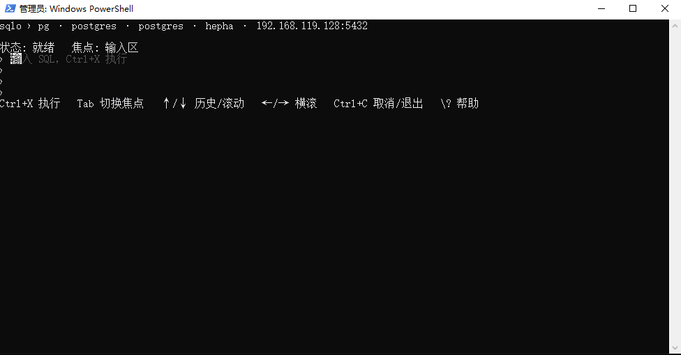
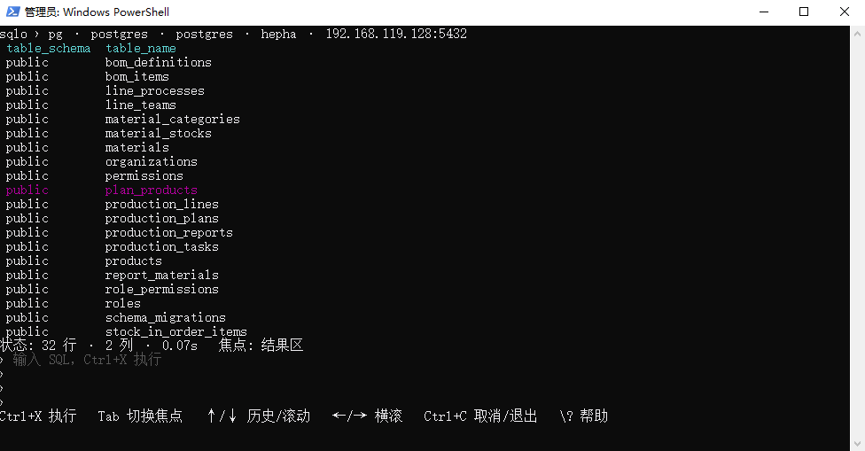
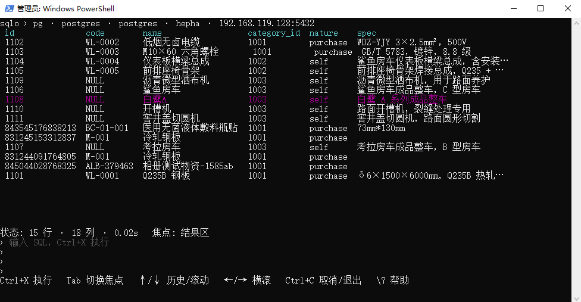

<h1 align="center">sqlo</h1>
<p align="center">
  
  
  
</p>
<hr>

## 简介

sqlo 是一个 Go 实现的多数据库命令行 SQL 工具，单二进制、零依赖、跨平台。支持主流关系型与国产数据库；AI Agent 友好，多连接管理命令行无缝切换，支持命令行 SQL 执行与文件批量导入；自带 TUI 支持垂直/水平滚动，视觉内容不混乱。所有驱动均为纯 Go 实现，无 CGO 依赖。

> **数据库支持**：MySQL / Oracle / PostgreSQL / SQL Server / SQLite / ClickHouse，国产化数据库（达梦 / 人大金仓 / TDengine / TiDB / OceanBase / PolarDB / GaussDB / TDSQL 等）详见下方「数据库支持」章节。

> **零 CGO**：默认构建（CGO_ENABLED=0）即可生成独立二进制，无需目标机器安装数据库客户端库。其中 SQLite 使用 modernc.org/sqlite，MS Access 使用 Windows ODBC syscall（仅 Windows 可用），达梦/金仓为官方便携 Go 驱动，均不依赖原生库。

---

## 界面展示

> 以下使用 GitHub 支持的静态表格排版实现照片墙效果。

<table>
  <tr>
    <td align="center">
      
      <br/>TUI 启动（编辑器就绪）
    </td>
    <td align="center">
      
      <br/>`\dt` 元命令 · 列出表
    </td>
  </tr>
  <tr>
    <td align="center" colspan="2">
      
      <br/>SQL 查询结果（高亮选中行）
    </td>
  </tr>
</table>

---

## 数据库支持

sqlo 对数据库的支持分为两类：**原生内置驱动**（随二进制一起编译，直接连接）与**兼容协议支持**（通过已有驱动的线协议兼容层连接，无需额外驱动或配置）。

### 原生内置驱动

以下数据库通过 sqlo 内置的纯 Go 驱动直接连接，完整列表由 `sqlo drivers` 运行时动态生成：

| 数据库            | 类型标识     | 驱动包                                                                  | 说明                              |
| ----------------- | ------------ | ----------------------------------------------------------------------- | --------------------------------- |
| PostgreSQL        | `postgres`   | `github.com/lib/pq`                                                     | 开源关系型                        |
| MySQL             | `mysql`      | `github.com/go-sql-driver/mysql`                                        | 开源关系型                        |
| SQL Server        | `sqlserver`  | `github.com/microsoft/go-mssqldb`                                       | 微软关系型                        |
| Oracle            | `oracle`     | `github.com/sijms/go-ora/v2`                                            | 甲骨文关系型                      |
| SQLite            | `sqlite`     | `modernc.org/sqlite`                                                    | 文件型                            |
| MS Access         | `access`     | `github.com/mattn/go-adodb`                                             | 文件型，仅 Windows，Windows ODBC  |
| ClickHouse        | `clickhouse` | `github.com/ClickHouse/clickhouse-go/v2`                                | 列式分析型                        |
| TDengine          | `tdengine`   | `github.com/taosdata/driver-go/v3/taosWS`                               | 时序型，WebSocket via taosAdapter |
| 达梦 DM           | `dameng`     | 本地引入 `third_party/dm`（模块名 `dm`，replace 引入）                  | 国产，官方纯 Go 驱动本地引入      |
| 人大金仓 Kingbase | `kingbase`   | 本地引入 `third_party/gokb`（模块名 `kingbase.com/gokb`，replace 引入） | 国产，官方 gokb 驱动本地引入      |

### 兼容协议支持（无需额外驱动）

许多分布式与国产数据库通过兼容 MySQL、Oracle 或 PostgreSQL 线协议实现互操作。sqlo 不为它们单独适配驱动——按下列兼容协议选对应的内置类型（`mysql` / `oracle` / `postgres`）连接即可，无需任何额外配置：

| 数据库       | 兼容协议                 | 连接要点                                                                                                                                |
| ------------ | ------------------------ | --------------------------------------------------------------------------------------------------------------------------------------- |
| TiDB         | MySQL                    | PingCAP 分布式数据库，原生 MySQL 协议兼容                                                                                               |
| OceanBase    | MySQL 模式 / Oracle 模式 | MySQL 模式用 `mysql`、Oracle 模式用 `oracle`；直连默认端口 2881（需 `-P` 覆盖 mysql 默认的 3306），租户账号格式 `user@tenant` 填在 `-u` |
| openGauss    | PostgreSQL               | 华为开源数据库，基于 PostgreSQL 内核，用 `postgres` 类型连接                                                                            |
| 华为 GaussDB | MySQL / PostgreSQL       | for MySQL 为 MySQL 兼容、集中式/分布式基于 openGauss 内核为 PostgreSQL 兼容，分别用 `mysql` / `postgres`                                |
| 腾讯 TDSQL   | MySQL 版 / PostgreSQL 版 | 按版本用 `mysql` 或 `postgres`                                                                                                          |
| 阿里 PolarDB | MySQL 版 / PostgreSQL 版 | 云原生，按版本用 `mysql` 或 `postgres`                                                                                                  |

> **说明**：兼容协议数据库的连接方式与对应原生数据库完全一致，仅需按上表兼容协议选用对应的 `-t` 类型，并填入该数据库实际的主机、端口与账号。因兼容层可能存在少量方言差异，个别特有语法或系统表查询可能不完全适用。

---

## 安装

### 二进制安装

```bash
# 下载对应平台的 sqlo 二进制，重命名为 sqlo
# Windows 放置在 C:\Windows\sqlo.exe 或加入 PATH
# Linux / macOS 放置在 /usr/local/bin/sqlo
```

### 从源码构建

```bash
git clone https://github.com/liang-junwei/sqlo.git
cd sqlo && go build -o sqlo .
# 跨平台交叉编辑
GOOS=linux GOARCH=amd64 go build -o sqlo .
```

---

## 快速开始

### 添加连接

```bash
# 网络型数据库（典型）
sqlo connect add -n prod-pg -t postgres -H 10.0.1.5 -P 5432 -u admin -p secret -d mydb

# 文件型数据库（仅需 -d 指定文件路径）
sqlo connect add -n myapp -t sqlite -d ./data/myapp.db

# 添加并设为默认连接
sqlo connect add -n dev-mysql -t mysql -H 127.0.0.1 -u root -p pass -d test --default
```

配置自动持久化到 `~/.sqlo.json`，支持管理多个连接。密码以明文写入配置文件（请确保该文件权限受控）。

### 全局参数

| 参数        | 简写 | 说明                                                        |
| ----------- | ---- | ----------------------------------------------------------- |
| `--server`  | `-S` | 指定目标 server context 名称（覆盖默认连接）                |
| `--output`  | `-o` | 输出格式：`table` / `json` / `yaml` / `csv`（默认 `table`） |
| `--quiet`   | `-q` | 静默模式，仅输出结果                                        |
| `--verbose` | `-v` | 详细输出                                                    |

> 行数限制 `--row-limit` **仅 `exec` 命令支持**（见下文）；探查命令 `tables` / `describe` 不受限。

---

## 命令概览

| 分类 | 命令        | 别名   | 说明                                              |
| ---- | ----------- | ------ | ------------------------------------------------- |
| 配置 | `connect`   |        | 管理数据库连接配置（add/list/use/delete/show）    |
| 执行 | `exec`      |        | 执行单条 SQL（支持 -e 内联 / -f 文件 / 位置参数） |
| 会话 | `tui`       |        | 启动交互式 TUI 会话（保持会话态）                 |
| 探查 | `databases` |        | 列出**服务器上的**数据库（需连接）                |
| 探查 | `tables`    |        | 列出当前库的表（需连接）                          |
| 探查 | `describe`  | `desc` | 查看表结构（需连接，等同 TUI 的 `\d`）            |
| 信息 | `drivers`   |        | 列出 sqlo 支持的驱动类型及默认端口（离线）        |
| 信息 | `version`   |        | 显示版本信息                                      |

> `databases` 与 `drivers` 的区别：`drivers` 是「sqlo 支持哪些数据库类型」（离线，不需要连接）；`databases` 是「当前连的这台服务器上有哪些库」（需要连接）。

---

## 典型用法

### 探查库表结构（databases / tables / describe）

无需记忆各数据库的系统表方言——sqlo 用每个驱动自带的元数据查询，命令在所有数据库上写法一致：

```bash
sqlo databases                    # 这台服务器上有哪些库
sqlo tables                       # 当前库有哪些表
sqlo describe users               # 查看 users 表结构
sqlo describe public.users        # postgres/mysql/oracle 等需 schema 的库可显式带
sqlo describe users -o json       # 结构化输出，便于脚本 / AI 解析
sqlo describe                     # 不带表名时退化为列出表，等同 sqlo tables

# 指定连接 / 临时切库
sqlo tables -S prod-pg -o json
sqlo tables -d other_db
```

> **说明**：`dameng` / `tdengine` 的 ListTables 模板带 `?` 占位符（分别是 owner / db_name），
> 已由 `BuildListTables` 自动注入当前连接用户名 / 当前库，`sqlo tables` 与 TUI 的 `\dt` 在这两个驱动上正常工作。

### 执行 SQL（exec）

```bash
# 内联 SQL
sqlo exec -e "SELECT * FROM users LIMIT 10"

# 指定输出格式
sqlo exec -e "SELECT * FROM users" -o json

# 从文件读取 SQL
sqlo exec -f query.sql

# 指定连接执行
sqlo exec -S dev-mysql -e "SHOW DATABASES"

# 非查询语句（INSERT/UPDATE/DELETE 等）
sqlo exec -e "INSERT INTO users (name) VALUES ('alice')"

# 临时切换数据库（不修改配置）
sqlo exec -d other_db -e "SELECT * FROM users"

# 运行时临时覆盖连接参数
sqlo exec --opt sslmode=disable -e "SELECT 1"
sqlo exec --opt "timeout=30,sslmode=require" -e "SELECT 1"

# 限制返回行数（仅 exec 支持，默认 500；0 表示无限制）
sqlo exec -S dev-mysql -e "SELECT * FROM big_table" --row-limit 100
sqlo exec -S dev-mysql -e "SELECT * FROM big_table" --row-limit 0   # 关闭上限
```

> `exec` 的 `--row-limit` 默认 `500`，超过则截断，截断提示写 stderr（stdout 的 `json` / `csv` 仍可直接解析）。`tables` / `describe` 等探查命令不受此限制。

### 交互式会话（tui）

TUI 只建立一次连接并在整个会话中保持，因此临时表、未提交事务、会话变量等会话状态会跨语句保留——这是与 `exec` 一次一连接模式的核心区别。

```bash
sqlo tui                              # 使用当前默认连接
sqlo tui -S dm-dev                    # 使用已保存的连接（全局参数 -S）
sqlo tui -t mysql -H 127.0.0.1 -u root -p pass   # 行内参数直连（无需先 connect add）
sqlo tui -d other_db                  # 临时切换数据库
sqlo tui --opt sslmode=disable
```

**常用按键：**

| 按键     | 作用                           |
| -------- | ------------------------------ |
| `Ctrl+X` | 执行当前 SQL                   |
| `Tab`    | 在编辑器与结果区之间切换焦点   |
| `Ctrl+C` | 取消正在执行的查询；空闲时退出 |
| `Esc`    | 退出                           |

**常用元命令：**

| 命令        | 作用                                |
| ----------- | ----------------------------------- |
| `\dt`       | 列出表                              |
| `\d <表>`   | 查看表结构                          |
| `\l`        | 列出数据库                          |
| `\c <名称>` | 切换连接                            |
| `\x`        | 扩展显示                            |
| `\o`        | 切换输出格式（table/json/csv/yaml） |
| `\?`        | 帮助                                |

### 连接管理

```bash
# 列出所有连接（标注当前默认）
sqlo connect list

# 切换默认连接
sqlo connect use dev-mysql

# 查看详情（密码脱敏显示）
sqlo connect show prod-pg

# 删除连接
sqlo connect delete old-conn
```

### 多连接执行

```bash
# 添加多台服务器的连接
sqlo connect add -n prod -t postgres -H 10.0.1.5 -u admin -p pass1 -d app --default
sqlo connect add -n staging -t postgres -H 10.0.2.5 -u admin -p pass2 -d app

# 查看配置列表
sqlo connect list

# 切换默认连接
sqlo connect use staging

# 临时指定连接执行命令
sqlo exec -S prod -e "SELECT count(*) FROM users"
```

---

## 连接流程

```
CLI 命令
   │
   ├─ 已保存 context:  ~/.sqlo.json 中按名称读取连接配置
   │       │
   │       └─ 或全局 -S <name> 指定目标
   │
   └─ 行内直连:  -t -H -P -u -p 直接构造（无需先 connect add）
                │
                ↓
        db.Connect / db.ConnectContext  (按类型选择驱动，构建 DSN)
                │
                ↓
            目标数据库
```

- 网络型数据库（postgres/mysql/sqlserver/oracle/clickhouse/tdengine/dameng/kingbase）需要 host 与 username
- 文件型数据库（sqlite/access）只需 `-d` 指定文件路径
- `exec` 命令一次一连接，不保留会话态；`tui` 全程保持单连接（连接池固定为 1），会话态跨语句保留

---

## 输出格式

支持四种格式，通过 `-o` 切换：

```bash
sqlo exec -e "SELECT * FROM users"              # 默认 table
sqlo exec -e "SELECT * FROM users" -o json      # JSON
sqlo exec -e "SELECT * FROM users" -o yaml      # YAML
sqlo exec -e "SELECT * FROM users" -o csv       # CSV
```

---

## 项目结构

```
sqlo/
├── main.go               # 入口
├── cmd/                 # CLI 命令定义
│   ├── root.go          # 根命令 + 全局 flags (-S/-o/-q/-v)
│   ├── connect.go       # 连接配置管理 (add/list/use/delete/show)
│   ├── exec.go          # 执行 SQL（查询 / 非查询分派 + --row-limit 截断，仅本命令）
│   ├── tui.go           # 交互式 TUI 启动与行内直连
│   ├── databases.go     # 列出当前服务器上的数据库（需连接）
│   ├── drivers.go       # 列出 sqlo 支持的驱动类型及默认端口（离线）
│   ├── tables.go        # 列出当前库的表（复用 driver.BuildListTables）
│   ├── describe.go      # 查看表结构（复用 driver.BuildDescribe，等同 TUI \d）
│   ├── introspect.go    # 内省命令共享辅助（连接/查询/-o 输出）
│   └── version.go       # 版本信息
├── internal/            # 私有包（Go 编译器强制，外部不可 import）
│   ├── config/          # 配置持久化 (~/.sqlo.json)
│   ├── db/              # 连接层（DSN 构建 + Connect/ConnectContext）
│   ├── driver/          # 驱动注册机制 + 各数据库驱动 + BuildDescribe + BuildListTables
│   ├── output/          # 输出格式化 (table/json/yaml/csv)
│   └── tui/             # 交互式界面 (bubbletea + bubbles + lipgloss)
├── third_party/         # 本地引入的第三方驱动 (dm / gokb)
├── go.mod
└── go.sum
```
